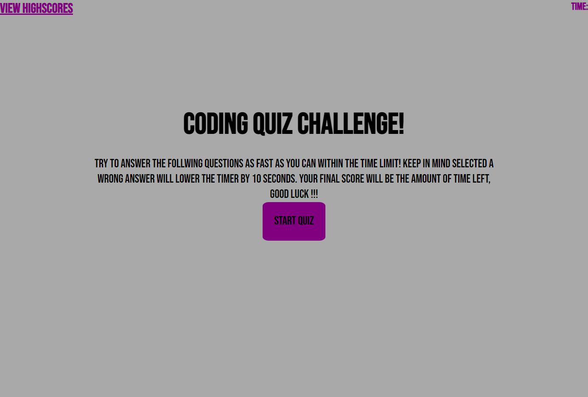

# Quiz

## Description

Inside this repo you will find a quiz website. This was creating to test the user on silly questions and to try to get the best score. It contains a start quiz page, the quiz, and a high score submition area.

## Installation

You can access the project by clicking on the github pages link that will take you to the live deployed site.

## Usage

To use this website you can click on the start quiz button which will start the quiz. After you finish you will be prompted to enter you name. After youve done that it will take you to the high score screen where you can see your scores. There is a play again button that will start the quiz again.

https://heyitsbradley.github.io/Quiz/

